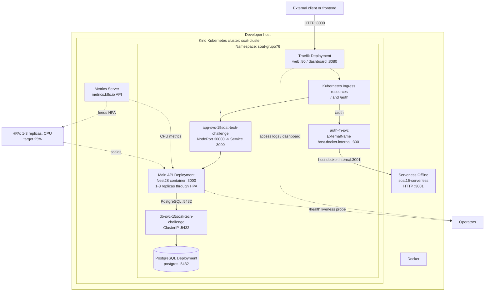
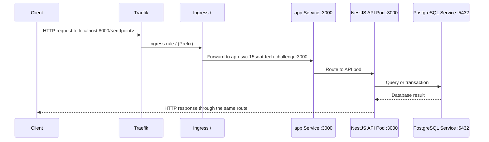
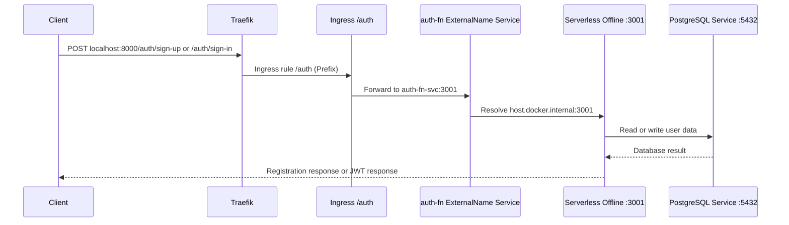
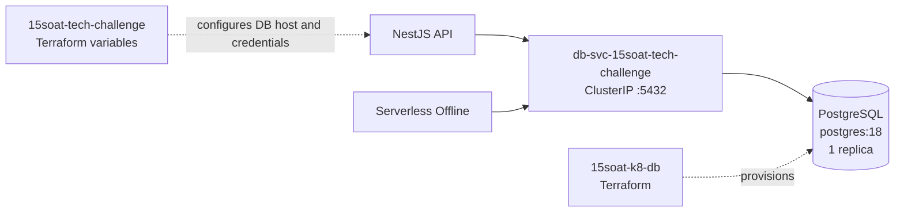
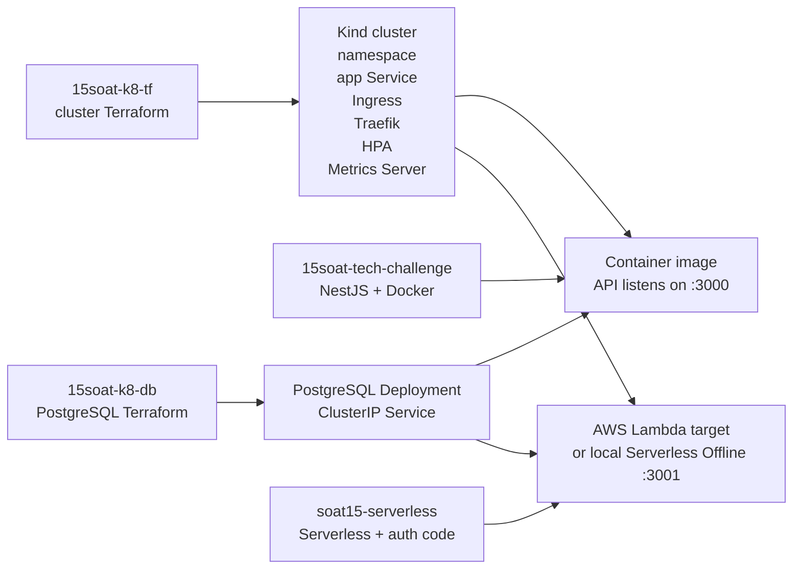
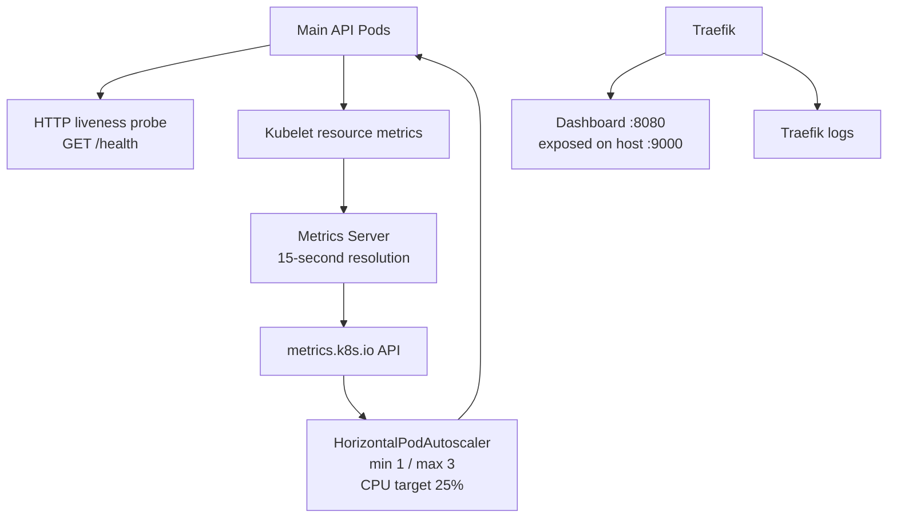

# System Component Diagram

## Purpose

This document describes the component architecture and request paths across the four repositories that compose the SOAT15 solution:

- `15soat-tech-challenge`: the main NestJS automotive services API;
- `soat15-serverless`: the authentication API implemented with Serverless Framework and used locally as a Lambda simulation;
- `15soat-k8-db`: Terraform resources for PostgreSQL;
- `15soat-k8-tf`: Terraform resources for the Kind cluster, application services, Traefik, Ingress, HPA, and Metrics Server.

The diagrams reflect the infrastructure currently defined in the repositories. The Kubernetes environment is a local Kind cluster running through Docker, not a managed cloud Kubernetes service.

## Overall Component View



## External Access and Port Mapping

The cluster Terraform configuration maps Kind node ports to the developer host:

| Host endpoint | Kind mapping | Kubernetes destination | Purpose |
|---|---:|---|---|
| `localhost:8000` | host `8000` -> node `30080` | Traefik Service `web:80` | Main API gateway entry point |
| `localhost:3000` | host `3000` -> node `30000` | Main API Service `:3000` | Direct NodePort access to the main API |
| `localhost:9000` | host `9000` -> node `30900` | Traefik dashboard `:8080` | Local Traefik dashboard |
| `localhost:3001` | host process | Serverless Offline `:3001` | Authentication function simulation |

The normal gateway path is therefore:

```text
Client -> localhost:8000 -> Kind node:30080 -> Traefik Service:80 -> Kubernetes Ingress
```

The port `8000` is the host-facing NodePort mapping for Traefik. It is not the application container port. The main NestJS container listens on port `3000`, while the Serverless Offline process listens on port `3001`.

## API Routing

### Main API path



The main API is a NestJS application organized around authentication, users, vehicles, resources, stock, and service orders. Its container exposes port `3000` and has a liveness probe against `/health`.

### Authentication path



The authentication function currently runs outside the Kind cluster as a host process. The `auth-fn` Kubernetes Service is an `ExternalName` service that points to `host.docker.internal` and port `3001`; it does not create a Lambda pod. The Serverless configuration still declares AWS Lambda as its deployment provider, but the Kubernetes integration described here uses `serverless offline` as the local simulation.

The serverless endpoints are:

- `POST /auth/sign-up`: validates the document, hashes the password with bcrypt, and creates the user;
- `POST /auth/sign-in`: validates the credentials against PostgreSQL and returns a JWT.

## Data Layer



The database repository provisions a single PostgreSQL Deployment and a ClusterIP Service in the shared namespace. The main API receives `DB_HOST=db-svc-15soat-tech-challenge` and connects through the Kubernetes Service. The serverless process must be configured with equivalent connection values that are reachable from the host environment.

The current Terraform resources do not define a managed cloud database, persistent volume, backup policy, replication, or failover topology. PostgreSQL is therefore a single local cluster workload in this environment.

## Infrastructure Responsibilities



| Repository | Main responsibility | Key resources or components |
|---|---|---|
| `15soat-tech-challenge` | Main business API | NestJS modules, Docker image, application Deployment and Service Terraform |
| `soat15-serverless` | Authentication API | `signUp`, `signIn`, PostgreSQL access, JWT generation, Serverless Offline, local Traefik configuration |
| `15soat-k8-db` | Database infrastructure | PostgreSQL Deployment and ClusterIP Service |
| `15soat-k8-tf` | Cluster and edge infrastructure | Kind cluster, namespace, Traefik, Ingress rules, auth ExternalName Service, HPA, Metrics Server |

## Monitoring and Scaling



The current monitoring and scaling capabilities are:

- the main API has a liveness probe at `/health`;
- Metrics Server collects node and pod resource metrics at a 15-second resolution;
- the HPA scales the main API Deployment from 1 to 3 replicas using average CPU utilization with a 25% target;
- Traefik exposes an insecure dashboard in the local cluster on host port `9000` and emits logs at `INFO` level;
- Kubernetes and Terraform state provide operational visibility into resource status.

No Prometheus, Grafana, CloudWatch integration, distributed tracing, centralized log storage, or application-level metrics exporter was found in the four repositories. These should be treated as future observability work rather than assumed components of the current architecture.

## Deployment and Runtime Modes

### Local Kind integration mode

1. `15soat-k8-tf` creates the Kind cluster, namespace, Traefik, Ingress, HPA, and Metrics Server.
2. `15soat-k8-db` creates PostgreSQL and its internal Service.
3. `15soat-tech-challenge` builds and deploys the main API container.
4. `soat15-serverless` runs `serverless offline` on the host at port `3001`.
5. The `/auth` Ingress route reaches that host process through `auth-fn-svc` and `host.docker.internal`.
6. Clients reach the shared gateway through `localhost:8000`.

### AWS Serverless deployment mode

The Serverless configuration declares AWS, region `us-east-1`, and Node.js 20. Running `serverless deploy` targets AWS resources according to the Serverless Framework configuration. That deployment path is separate from the local Kind routing described above. The current Terraform `auth-fn` integration does not point to AWS Lambda; it points to the host's Serverless Offline listener.

## Architecture Notes and Risks

- The application and database are local Kind workloads, so this setup is suitable for development or demonstration rather than high availability.
- The authentication function and main API share PostgreSQL, which makes the database a shared dependency and capacity boundary.
- The `/auth` route depends on `host.docker.internal`, Docker host networking, and a manually running process on port `3001`.
- The Traefik dashboard is configured with `--api.insecure=true`; it must not be exposed this way in a production environment.
- Terraform variables and local state may contain credentials or cluster certificates. Secret values and state files must be protected and must not be committed.
- The HPA requires Metrics Server and meaningful CPU requests; the main API deployment provides CPU requests and limits, which enables the configured CPU-based decision.
